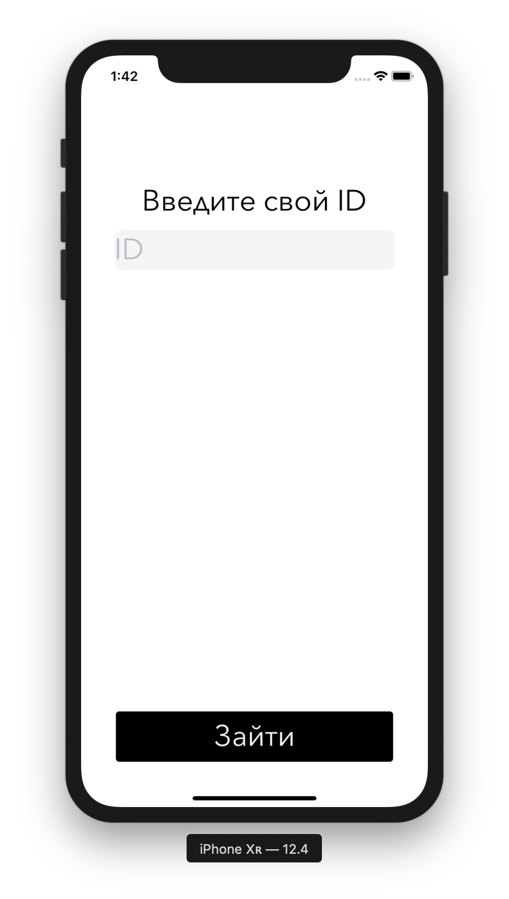
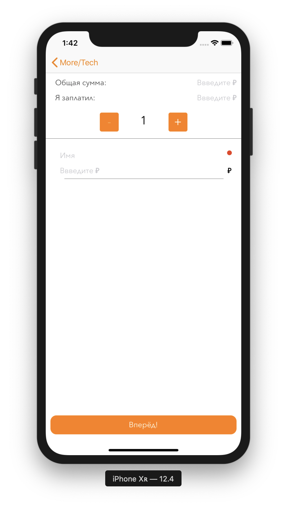
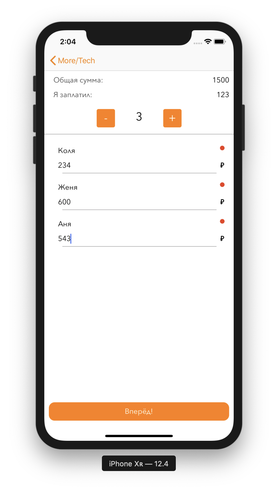
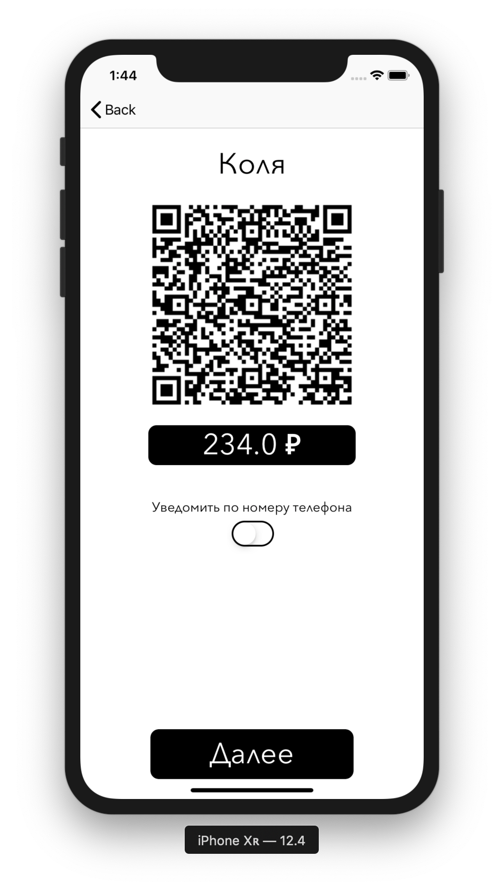
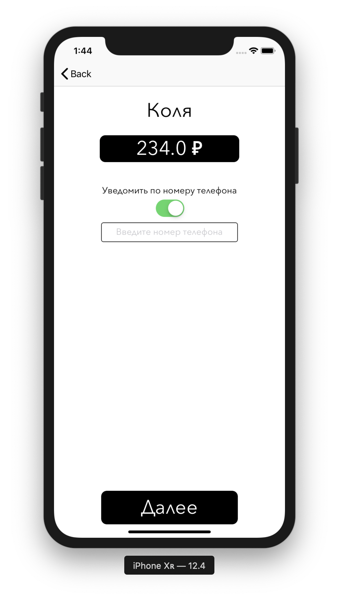
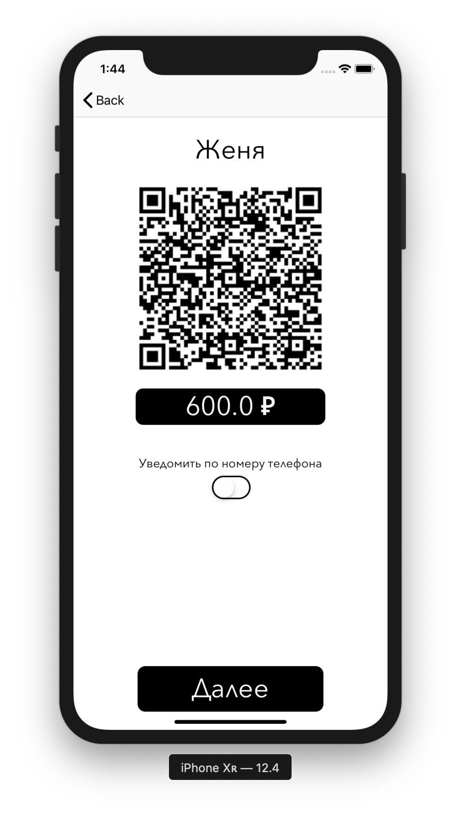
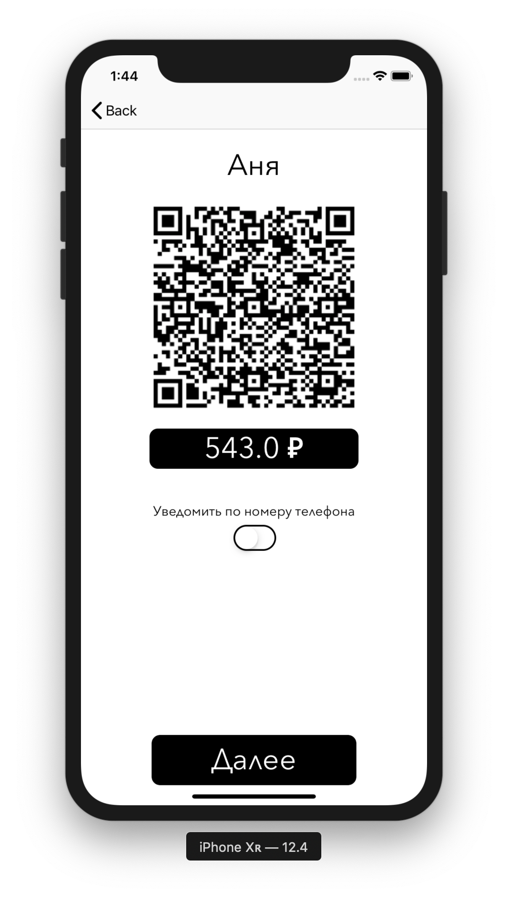

## Задача приложения:

Вы пришли в ресторан с друзьями и оплатили весь счет. Теперь вы хотите поделить чек на всех остальных участников. 

---

### Идея:

Нужно понять, как быстро разбить счет, на нужное количество денег каждому человеку

### Варианты решения:

1. Все сканируют у организатора, по выставленным  им QR-кодам для каждого участника, либо организатор, отправляет запрос на оплату через номер телефона(Это в случае когда человек не может сканировать qr-коды).

2. Каждый достает QR-код своего кошелька, и организатор отправляет каждому уведомление на оплату. Если у человека нет телефона, то ему отправить уведомление об оплате через ID кошелька (номер телефона).
   
   ---

### Выбрано первое решение

Когда все сканирует qr-код у организатора

---

### Скриншоты приложения

 

